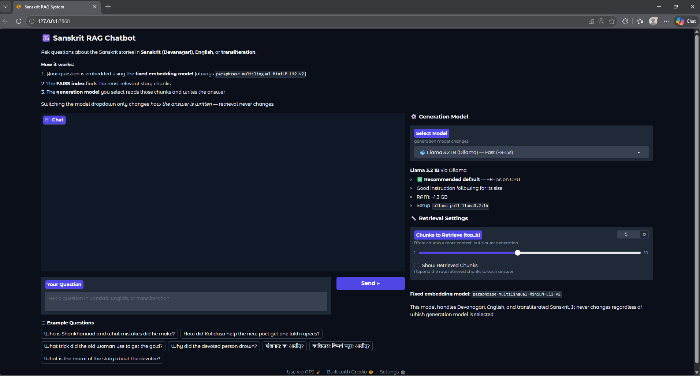
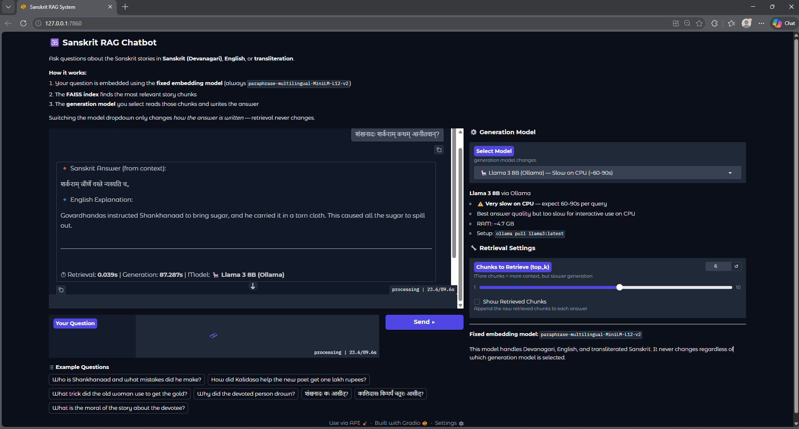

# 🕉️ Sanskrit RAG System

> A **Retrieval-Augmented Generation (RAG)** pipeline for querying Sanskrit documents written in Devanagari script — supporting Sanskrit, English, and IAST transliteration.

---

## Table of Contents

- [Overview](#overview)
- [Architecture](#architecture)
- [Technology Stack](#technology-stack)
- [Project Structure](#project-structure)
- [Setup & Installation](#setup--installation)
- [Configuration](#configuration)
- [Running the System](#running-the-system)
- [Example Queries](#example-queries)
- [Screenshots](#screenshots)
- [Evaluation](#evaluation)
- [Corpus](#corpus)
- [Troubleshooting](#troubleshooting)
- [License](#license)

---

## Overview

The Sanskrit RAG System allows users to ask questions — in Sanskrit (Devanagari), English, or IAST transliteration — and receive grounded, context-faithful answers drawn exclusively from a Sanskrit document corpus. It uses dense vector retrieval (FAISS) combined with an LLM generator to produce answers without hallucination.

**Key features:**

- Multilingual query support (Sanskrit / English / IAST)
- Sanskrit-aware chunking that preserves Devanagari sentence boundaries (danda `।`, double-danda `॥`)
- Story-boundary splitting so Sanskrit originals and their English translations are never separated
- Multiple LLM backends — Ollama, HuggingFace Transformers, llama-cpp, or Simple (no LLM)
- FAISS cosine-similarity retrieval with configurable threshold to prevent irrelevant retrievals
- Strict anti-hallucination prompt design with explicit forbidden behaviours
- Interactive CLI, single-shot query mode, and Gradio chat UI
- Built-in evaluation suite (Keyword Hit Rate, MRR@4, latency)

---

## Architecture

### Ingestion Pipeline

```
.txt / .docx / .pdf
        │
        ▼
 DocumentLoader          ← Handles UTF-8 Devanagari, pdfplumber, python-docx
        │
        ▼
  Preprocessor           ← NFC normalisation, story splitting (=== delimiters),
        │                   danda-aware sentence splitting, overlapping chunks
        ▼
SentenceTransformer      ← paraphrase-multilingual-MiniLM-L12-v2 (dim=384)
        │                   normalised embeddings for cosine similarity
        ▼
  FAISS IndexFlatIP      ← Persisted to vector_store/faiss_index.bin
  + metadata.json        ← Chunk text, source, story title, has_devanagari flag
```

### Query Pipeline

```
User Query (Sanskrit / English / IAST)
        │
        ▼
  normalise_query        ← NFC, lowercase Latin only, collapse whitespace
        │
        ▼
  Embed Query            ← Same SentenceTransformer model
        │
        ▼
  FAISS Search           ← top-k chunks, cosine similarity threshold filter
        │
        ▼
  Context Assembly       ← Join chunk texts (no metadata noise to LLM)
        │
        ▼
  LLM Generator          ← Strict system prompt, low temperature (0.1)
        │
        ▼
  Final Answer           ← Grounded in retrieved context only
```

---

## Technology Stack

| Component | Library / Model | Purpose |
|---|---|---|
| **Document Loader** | `python-docx`, `pdfplumber`, `PyPDF2` | Load `.txt`, `.docx`, `.pdf` |
| **Preprocessor** | Custom — Unicode NFC + Sanskrit danda-aware | Clean, split, chunk text |
| **Embeddings** | `sentence-transformers` — `paraphrase-multilingual-MiniLM-L12-v2` | Multilingual dense vectors (dim=384) |
| **Vector Store** | `faiss-cpu` — `IndexFlatIP` | Cosine similarity search (CPU) |
| **LLM — Ollama** | `llama3:latest` (recommended) | Local server, best instruction following |
| **LLM — Transformers** | `google/flan-t5-large` | Auto-download, no server needed |
| **LLM — llama.cpp** | TinyLlama 1.1B Q4_K_M GGUF | Quantised CPU inference |
| **LLM — Simple** | None | Returns raw retrieved context |
| **UI** | `gradio` | Web-based chat interface |
| **Evaluation** | Custom — Keyword Hit Rate, MRR@4 | Quality & latency metrics |

---

## Project Structure

```
RAG_Sanskrit/
│
├── code/
│   ├── config.py              # Central configuration — models, paths, thresholds
│   ├── document_loader.py     # Load .txt / .docx / .pdf documents
│   ├── preprocessor.py        # Sanskrit-aware cleaning, chunking, query normalisation
│   ├── retriever.py           # FAISS index build, save, load, retrieve
│   ├── generator.py           # LLM backends + anti-hallucination prompt
│   ├── rag_pipeline.py        # End-to-end orchestration
│   ├── query_interface.py     # Interactive CLI + single-shot mode
│   ├── main.py                # Entry point — demo & evaluation modes
│   ├── gradio_app.py          # Gradio web chat UI
│   └── evaluate.py            # Evaluation suite (MRR, keyword hit, latency)
│
├── data/
│   └── sanskrit_corpus.txt    # Sanskrit source documents (Devanagari + English)
│
├── vector_store/              # Auto-created on first run
│   ├── faiss_index.bin        # Persisted FAISS index
│   └── metadata.json          # Chunk metadata (source, title, text, flags)
│
├── models/                    # Place GGUF model files here (llama-cpp backend)
│
├── requirements.txt
└── README.md

> **Note:** The `vector_store/` directory is **not included in the repo**.
> It is created automatically the first time you run `main.py` or `query_interface.py`.
> Do not create it manually.
```

---

## Setup & Installation

### Prerequisites

* Python 3.9 or higher — verify with `python --version` or `python3 --version`
* pip — verify with `pip --version`
- (Optional) [Ollama](https://ollama.com/download) for the recommended LLM backend

### 1. Clone the Repository

```bash
git clone https://github.com/shrutivinodshinde/RAG_Sanskrit_Shruti_Shinde.git
cd RAG_Sanskrit_Shruti_Shinde
```

### 2. Create a Virtual Environment

```bash
python3 -m venv venv

# Linux / macOS
source venv/bin/activate

# Windows
venv\Scripts\activate
```

### 3. Install Dependencies

```bash
pip install -r requirements.txt
```

> **Note:** PyTorch CPU build is approximately 700 MB. First install may take a few minutes depending on your internet speed.
> **No API keys required.** All LLM backends (Ollama, Transformers, llama-cpp, Simple) run
> fully locally. No OpenAI, Anthropic, or cloud credentials are needed.

### 4. Add Sanskrit Documents

Place your `.txt`, `.docx`, or `.pdf` files inside the `data/` directory. The corpus should use UTF-8 encoding with Devanagari text. Story sections can be separated using `==========` (10+ equals signs) delimiters with a title line between them.

---

## Configuration

All settings are centralised in `code/config.py`. The most important options are:

### LLM Backend

```python
# Option A — Ollama (Recommended)
# Requires Ollama app + model pull (see below)
LLM_BACKEND = "ollama"
OLLAMA_MODEL = "llama3:latest"

# Option B — HuggingFace Transformers (Easy setup, no server needed)
LLM_BACKEND = "transformers"
TRANSFORMERS_MODEL = "google/flan-t5-large"   # auto-downloaded on first run

# Option C — llama-cpp (Quantised local inference)
LLM_BACKEND = "llama_cpp"
LLAMA_MODEL_PATH = "../models/tinyllama-1.1b-chat-v1.0.Q4_K_M.gguf"

# Option D — Simple (No LLM, returns raw retrieved context)
LLM_BACKEND = "simple"
```

### Retrieval Settings

```python
TOP_K = 5                  # Number of chunks to retrieve per query
SIMILARITY_THRESHOLD = 0.35  # Minimum cosine similarity score (raise to reduce noise)
CHUNK_SIZE = 800           # Maximum characters per chunk
CHUNK_OVERLAP = 150        # Overlap between consecutive chunks
```

### Setting Up Ollama (Recommended)

```bash
# 1. Install Ollama: https://ollama.com/download

# 2. Pull a model
ollama pull llama3:latest        # ~4 GB, best quality
ollama pull llama3.2:1b          # ~1 GB, fastest

# 3. Start the server (usually starts automatically)
ollama serve

# 4. Set in config.py
OLLAMA_MODEL = "llama3:latest"
```

### Downloading a GGUF Model (llama-cpp backend)

```bash
pip install llama-cpp-python

# Download TinyLlama (~700 MB)
wget https://huggingface.co/TheBloke/TinyLlama-1.1B-Chat-v1.0-GGUF/resolve/main/tinyllama-1.1b-chat-v1.0.Q4_K_M.gguf -P models/
```

---

## Running the System

### Interactive CLI (Recommended)

```bash
cd code
python query_interface.py
```

### Single-Shot Query (Non-interactive)

```bash
cd code

# Plain text output
python query_interface.py --query "What did King Bhoj promise?"

# With context chunks shown
python query_interface.py --query "कालिदासः कः?" --context --top-k 3

# JSON output (for programmatic use)
python query_interface.py --query "Who was Shankhanaad?" --json
```

### Gradio Web UI

```bash
cd code
python gradio_app.py
# Open http://127.0.0.1:7860 in your browser
```

### Demo Mode (Runs all sample queries)

```bash
cd code
python main.py --demo
```

### Default Mode (3 sample queries)

```bash
cd code
python main.py
```

### Adding New Documents & Rebuilding the Index

To add your own Sanskrit (or bilingual) documents:

1. Place your `.txt`, `.docx`, or `.pdf` files in the `data/` directory.
2. Ensure files use **UTF-8 encoding** with Devanagari text.
3. Optionally separate story sections using `==========` (10+ `=` signs) with a title line between them.
4. Rebuild the FAISS index to include the new documents:

```bash
cd code
python main.py --rebuild
```

> The old `vector_store/` index is overwritten. Queries after this will reflect the updated corpus.

### Run Evaluation Suite

```bash
cd code
python evaluate.py

# Save results to JSON
python evaluate.py --output ../report/eval_results.json
```

---

## Example Queries

**English query:**
```
Query › Who was Shankhanaad and what mistakes did he make?

```

**Sanskrit query:**
```
Query › शंखनादः शर्कराम् कथम् आनीतवान्?

```

**English query:**
```
Query › How did Kalidasa help the new poet get one lakh rupees?

```

### Out-of-Corpus Queries (Graceful refusal)

```
Query › Who wrote the Mahabharata?

```

```
Query › श्वानशावकस्य मृत्यु: कथम् अभवत्?
```

---

## Screenshots

### Gradio Chat Interface

The system provides a CPU-based interactive Gradio chatbot interface for querying Sanskrit documents in Devanagari, English, or transliteration.



---

### Sanskrit Query Example

Example showing a Sanskrit query and the grounded answer generated from retrieved document chunks.



---

## Evaluation

The evaluation suite (`evaluate.py`) tests the pipeline against a built-in ground-truth set of 8 questions (mix of English and Sanskrit).

### Metrics

| Metric | Description |
|---|---|
| **Keyword Hit Rate** | Fraction of expected answer keywords found in the generated answer |
| **MRR@4** | Mean Reciprocal Rank — how early the relevant chunk appears in the top-4 results |
| **Retrieval Latency** | Time in seconds for FAISS vector search |
| **Generation Latency** | Time in seconds for LLM text generation |
| **RAM Delta** | Memory change per query (via `psutil`) |

## Corpus

The default corpus (`data/sanskrit_corpus.txt`) contains five bilingual Sanskrit prose stories — each with the original Devanagari text and an interleaved English translation.

| Story | Sanskrit Title | Summary |
|---|---|---|
| 1 | मूर्खभृत्यस्य कथा | The foolish servant Shankhanaad and his repeated blunders |
| 2 | चतुरस्य कालीदासस्य कथा | How Kalidasa cleverly helped a new poet win one lakh rupees from King Bhoj |
| 3 | वृद्धायाः चातुर्यम् | The old woman's clever solution to rid her village of a phantom demon |
| 4 | भक्तः देवश्च | The devoted person who refused human help and drowned waiting for God |
| 5 | शीतं बहु बाधते | Kalidasa corrects a foreign scholar's Sanskrit grammar mistake in disguise |


## Troubleshooting

**`ModuleNotFoundError: faiss`**
```bash
pip install faiss-cpu
```

**`ModuleNotFoundError: sentence_transformers`**
```bash
pip install sentence-transformers
```

**`RuntimeError: Ollama server is not running`**
```bash
ollama serve
# Then retry. On most systems Ollama starts automatically after install.
```

**`RuntimeError: Model 'llama3:latest' not found in Ollama`**
```bash
ollama pull llama3:latest
```

**GGUF model not found**
```
Set LLM_BACKEND = "transformers" in config.py, or download the model to models/.
```

**Slow generation / high latency**
```
1. Switch to LLM_BACKEND = "simple" for instant responses (no LLM).
2. Use a smaller model: TRANSFORMERS_MODEL = "google/flan-t5-base"
3. Reduce num_predict in generator.py from 300 to 100.
```

**LLM hallucinating answers not in corpus**
```
Raise SIMILARITY_THRESHOLD in config.py from 0.20 to 0.35–0.45.
This filters out weakly-matched chunks before they reach the LLM.
```

**High generation time for "not found" answers**
```
Add an early-exit check in rag_pipeline.py after retrieval:
if not results:
    return {"answer": "I could not find the answer in the provided documents.", ...}
```

---

## License

MIT License — free for academic and commercial use.

---
